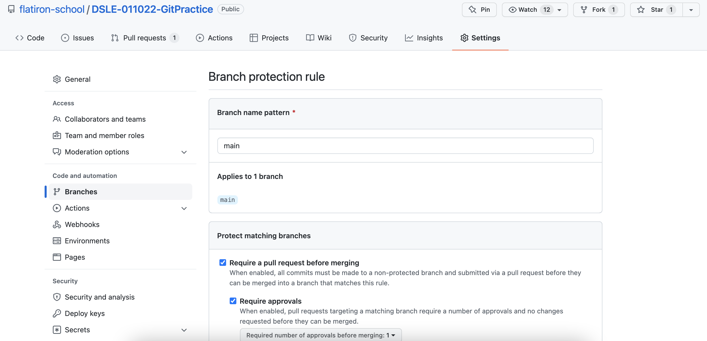
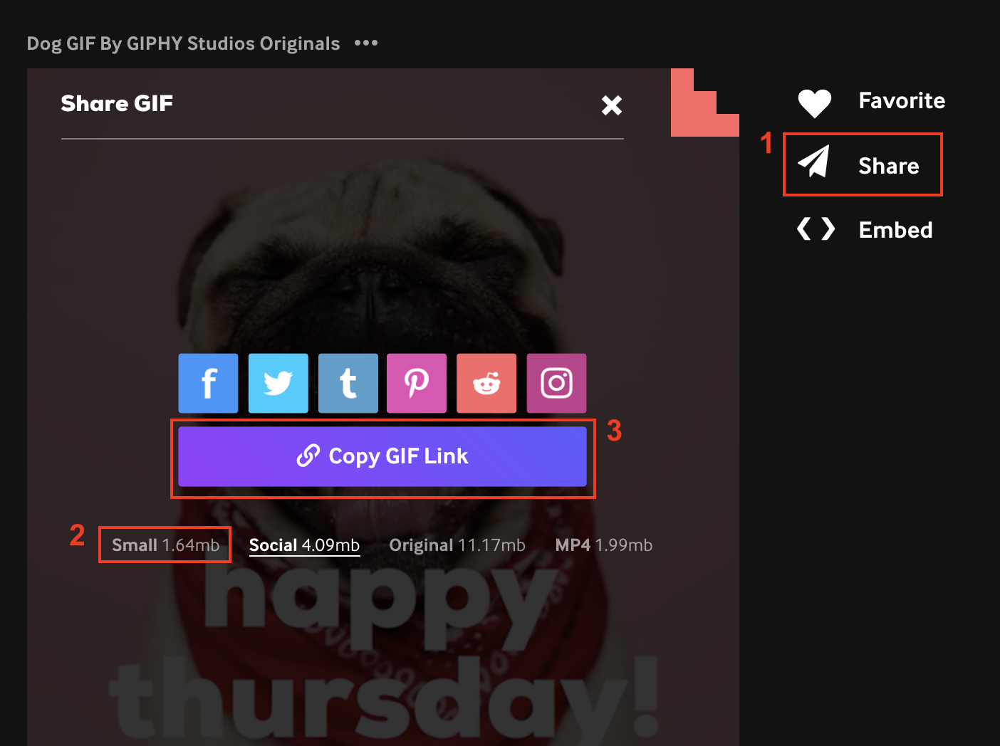

# Guided Git Gif-Stravaganza

## Materials

Example for the DSLE-011022 Cohort: https://github.com/flatiron-school/DSLE-011022-GitPractice

## Learning Objectives

- Demonstrate their understanding of git/GitHub
- Practice the git branching workflow they'll be expected to use for team projects

## Prerequisites

To prepare the repository, instructors will need to:

1. Create a new public repository
2. Copy the README from a previous example (like the one linked above)
3. Edit the README to change the cohort-specific references (currently just at the top), change the reference to the instructor in Step 3 if necessary, and add the names of both instructors and all students for the session with a few empty lines between each name. At this point, the lead instructor can go ahead and add a gif under their name.
4. Create a branch protection rule for the `main` branch of the repo, so that you both require a pull request before merging and require 1 approval before requested changes can be merged:
    - 
5. Gather a list of the GitHub email addresss for all students who will be participating in the session

**NOTE: If you don't do Step 4 above, students will likely just commit to the main branch on accident!** Be sure to follow those steps closely to set the session up for success.

Either before the session or at the very beginning (both have worked well in past sessions), the instructor will need to manage access for the repo (in Settings) and add each student as a collaborator with Write access. Students will need to go into their email inboxes and accept that invitation before they are able to push to the repository.

## Lesson Plan - at least 20 minutes

### Introduction (5 minutes)

Introduce the goal of this session (for each student to have a gif under their name, which they add to the README by using a branching git workflow - aka through git branches and pull requests). Be sure that you have the correct email address (or GitHub username) for each student and that they have been added as collaborators with write access to the repository.

### Guided Example (15 minutes)

Go through the listed steps as if you were a student. 

Important pieces to highlight:
- Students should NOT fork the repository, simply clone the original repo
- Demonstrate Markdown syntax for adding images, and the importance of adding text inside the square brackets for images (since this text renders if an image does not load, or is what's read if someone is using a screenreader - inclusivity is important!)

Note that these steps don't give the exact command on purpose - encourage students to be taking notes or following along with the guided example, and encourage them to use `git status` to check the status of the repo and to find out the likely next step.

As an instructor, go all the way through creating the pull request - but typically it's fine to leave that pull request open so that students can see what that looks like.

### Their Turn! Also Q&A (depends)

Students should then go through and follow the steps on their own, creating their own pull request to add their gif to the README. Typically, you can set a deadline for students to add their pull request (for example, the end of the week), so that students can go through the activity at their own pace (especially if you run this session early on and students are still struggling with set up or GitHub authentication). Then the rest of the time can be dedicated towards handling issues and answering questions.

## After the Session

To check if the pull request should be accepted, instructors should view the open pull requests, where you should be able to view and review the changes (you may want to click the "Display the rich diff" option to be sure the gif link actually works, since sometimes it's hard to tell just from looking at the markdown syntax). When reviewing, if the student needs to make a change, describe that change specifically for them in the comment box when requesting changes.

Instructors should periodically check the repo between the session and the deadline for new pull requests, and follow up with students who have not added their gif successfully as they may need individual attention.

## Tips

- I recommend that students go to [giphy.com](https://giphy.com/) to search for gifs. Form there, they should 1) click "Share", 2) make sure they choose the "Small" option (if the file size is too large, it might not render on the README), then 3) click "Copy GIF Link":
    - 
- If students are having trouble accessing the repository, be sure that they have accepted the invitation to collaborate on the repo, and are using the same email address/GitHub account as the one that was invited
- If a student ignores the bolded warning in Step 2 and forks the repository, it's a good chance to teach the class about remotes - adding remotes (`git remote add upstream <original repo url>`), checking remotes (`git remote -v`), then pushing to remotes (`git push <remote name> <branch name>`)
